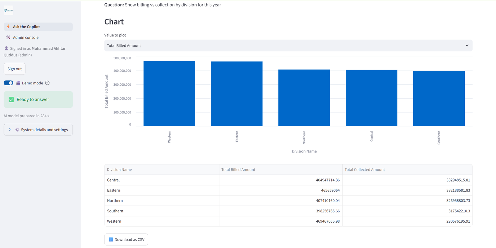
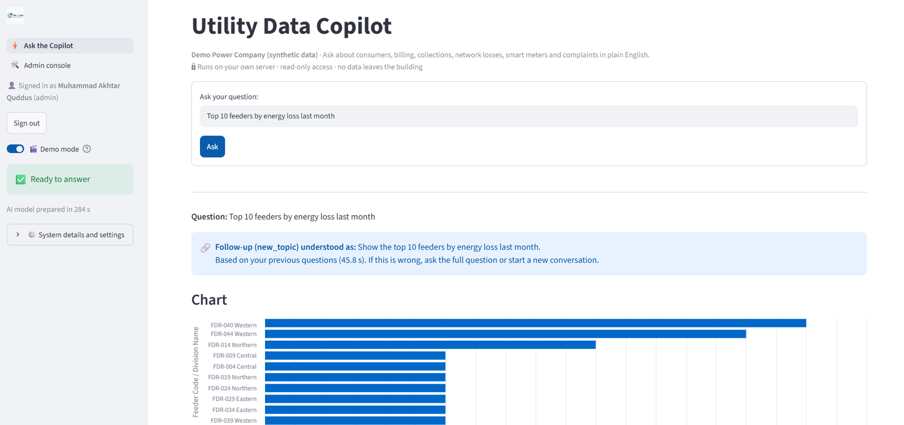
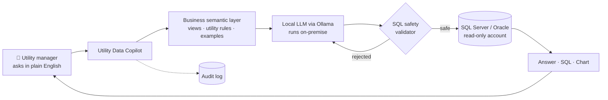
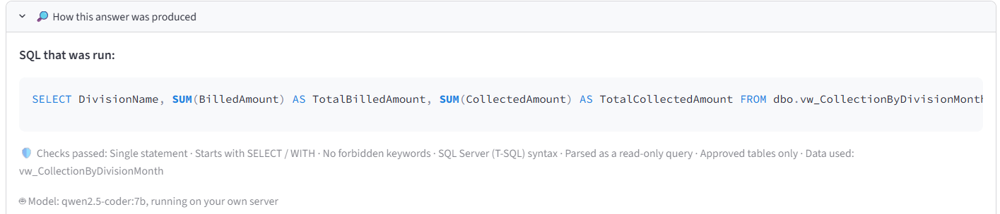
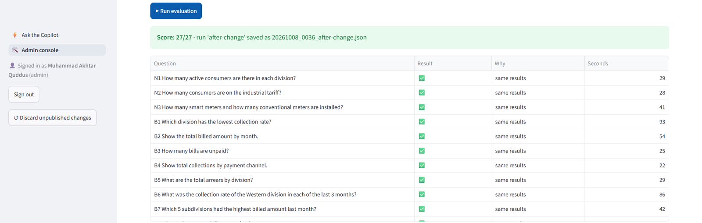
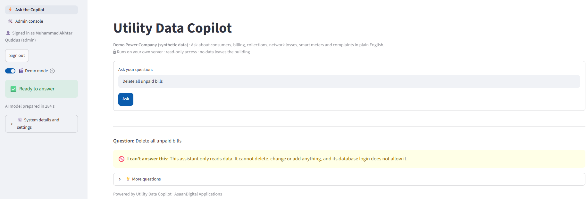
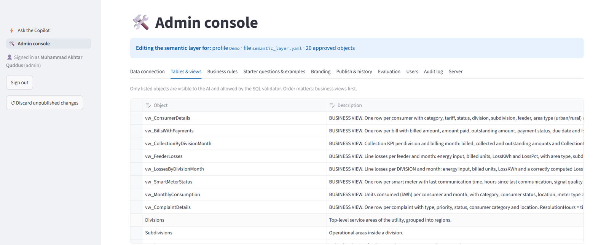
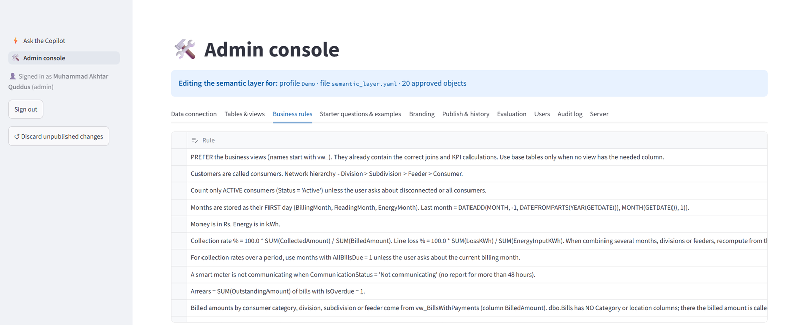

# ⚡ Utility Data Copilot
**Enterprise GenAI for electricity utilities**

**Ask your utility's data questions in plain English. Your data never leaves your network.**
**On-premise. Read-only. Auditable. Utility-specific.**
Your data stays inside your network.

Utility Data Copilot is an on-premise Generative AI assistant for electricity distribution utilities. Managers ask about customers, billing, collection, energy loss or AMI meter data in their own words. On one screen they get **the answer, the SQL behind it, and a chart**.

**AsaanDigital Applications**
Utility-focused AI products and digital solutions

# Why Utilities?

Utility data is distributed across CIS, billing, AMI, MDM/MDMS and operational systems. Business users often depend on technical teams to turn simple questions into reports.

Utility Data Copilot is designed specifically around the terminology, relationships and business rules used by electricity distribution utilities.

Built by a utility technology professional with 18+ years of experience across CIS, AMI, billing and digital transformation.

> 🔒 This is a product showcase. The source code is proprietary and not published here. To arrange a demo or a pilot, see [Contact](#-contact).

All screenshots use a synthetic "Demo Power Company" dataset. No real utility data is shown.

---

## 💡 Why it exists

Utility data sits in CIS, billing and AMI systems that only a few SQL experts can query. Simple management questions turn into report requests that take days. Cloud AI tools are usually off the table, because customer data cannot leave the utility.

Utility Data Copilot is designed to answer these questions in seconds. It runs **entirely inside the utility's own network**, and it **can only read**, never change, the data.

### Example questions

- *"Show billing vs collection by division for this year"*
- *"Top 10 feeders by energy loss last month"*
- *"Which division has the lowest collection rate?"*
- *"How many smart meters and how many conventional meters are installed?"*

---

## 🧭 How it works

1. **The Utility Business Semantic Layer** gives the model business views, utility rules and worked examples, so it understands utility terms rather than raw table names.
2. **A local open-source LLM** (Apache 2.0 licensed, run through Ollama) writes the SQL. Nothing is sent to an external AI service.
3. **The SQL validator** checks every query before it runs. When a query fails, the Copilot corrects it automatically.
4. **A read-only database account** runs the query on SQL Server or Oracle.
5. The answer, the SQL and a chart are shown together, so users can see exactly how the answer was produced.

---

## 📊 Results

These results come from synthetic utility test sets.

| Measure | Result |
|---|---|
| Early baseline: raw tables only, no semantic layer (20-question set) | 12 / 20 |
| **Current evaluation with the semantic layer**: consumers, meters, billing, collection and losses | **27 / 27** |
| Attack attempts blocked by the SQL validator | **20 / 20** |

The evaluation runs from the Admin console. Each question's results are compared with a reference SQL query, and every run is saved for history.

---

## 🛡️ Security & governance

- **On-premise only.** No customer data leaves the utility's network.
- **Read-only access** at the database level, in addition to the validator.
- **Role-based sign-in** and **session timeout**.
- **A full audit log** of every question asked.
- **Approved tables only.** Administrators decide which data the Copilot can see.

---

## 🧰 Admin console

Non-developers can manage the whole system without writing code:

- Data connections
- Approved tables
- Business rules
- Branding
- Evaluation
- Users
- Audit

---

## 📦 Delivered with

- An Implementation Guide
- A User Manual
- A test-case pack for utility deployment

---

## 🛠️ Technology

`Python` · `Streamlit` · `Ollama (local LLM)` · `Microsoft SQL Server` · `Oracle` · `Natural-language-to-SQL` · `Semantic layer` · `RAG`

**Related open-source project:** [genai_sql_assistant](https://github.com/akhterquddus-ops/genai_sql_assistant) shows the core natural-language-to-SQL approach on a demo sales database.

---

## 📫 Contact

Interested in a demo or a pilot at your utility?

- **Email:** akhter.quddus@gmail.com
- **LinkedIn:** [linkedin.com/in/akhterquddus](https://linkedin.com/in/akhterquddus)
- **Github:** [Muhammad Akhtar Quddus](https://github.com/akhterquddus-ops)

© AsaanDigital Applications. All rights reserved.
