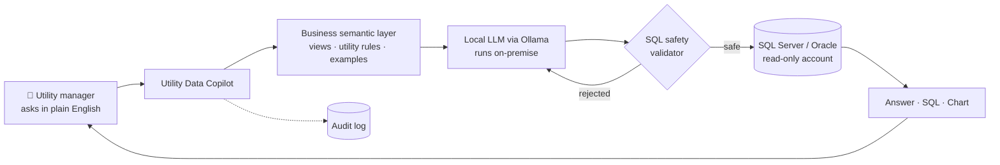

# ⚡ Utility Data Copilot

**Ask your utility's data questions in plain English. Your data never leaves your network.**

Utility Data Copilot is an on-premise Generative AI assistant for electricity distribution utilities. Managers ask about customers, billing, collection, energy loss or AMI meter data in their own words. On one screen they get **the answer, the SQL behind it, and a chart**.

Built by [Muhammad Akhtar Quddus](https://github.com/akhterquddus-ops) · **AsaanDigital Applications**

> 🔒 This is a product showcase. The source code is proprietary and not published here. To arrange a demo or a pilot, see [Contact](#-contact).

<!-- Add a screenshot of the main screen here:

-->

---

## 💡 Why it exists

Utility data sits in CIS, billing and AMI systems that only a few SQL experts can query. Simple management questions turn into report requests that take days. Cloud AI tools are usually off the table, because customer data cannot leave the utility.

Utility Data Copilot answers these questions in seconds. It runs **entirely inside the utility's own network**, and it **can only read**, never change, the data.

### Example questions

These examples are illustrative.

- *"Which feeders had the highest energy loss last month?"*
- *"Show total billing versus collection by division for this year."*
- *"How many consumers have had zero consumption for the last 3 months?"*
- *"List the top 10 defaulters in Islamabad circle."*

---

## 🧭 How it works

1. **The semantic layer** gives the model business views, utility rules and worked examples, so it understands utility terms rather than raw table names.
2. **A local open-source LLM** (Apache 2.0 licensed, run through Ollama) writes the SQL. Nothing is sent to an external AI service.
3. **The SQL validator** checks every query before it runs. When a query fails, the Copilot corrects it automatically.
4. **A read-only database account** runs the query on SQL Server or Oracle.
5. The answer, the SQL and a chart are shown together, so users can see exactly how the answer was produced.

---

## 📊 Results

These results come from a synthetic utility test set.

| Measure | Result |
|---|---|
| Answer accuracy, tables only (no semantic layer) | 12 / 20 |
| Answer accuracy **with the semantic layer**, same model and database | **23 / 23**, including held-out questions |
| Attack attempts blocked by the SQL validator | **20 / 20** |

---

## 🛡️ Security & governance

- **On-premise only.** No customer data leaves the utility's network.
- **Read-only access** at the database level, in addition to the validator.
- **Role-based sign-in** and **session timeout**.
- **A full audit log** of every question asked.
- **Approved tables only.** Administrators decide which data the Copilot can see.

---

## 🧰 Admin console

Non-developers can manage the whole system without writing code:

- Data connections
- Approved tables
- Business rules
- Branding
- Evaluation
- Users
- Audit

---

## 📦 Delivered with

- An Implementation Guide
- A User Manual
- A test-case pack for utility deployment

---

## 🛠️ Technology

`Python` · `Streamlit` · `Ollama (local LLM)` · `Microsoft SQL Server` · `Oracle` · `Natural-language-to-SQL` · `Semantic layer` · `RAG`

**Related open-source project:** [genai_sql_assistant](https://github.com/akhterquddus-ops/genai_sql_assistant) shows the core natural-language-to-SQL approach on a demo sales database.

---

## 📫 Contact

Interested in a demo or a pilot at your utility?

- **Email:** akhter.quddus@gmail.com
- **LinkedIn:** [linkedin.com/in/akhterquddus](https://linkedin.com/in/akhterquddus)

© AsaanDigital Applications. All rights reserved.
